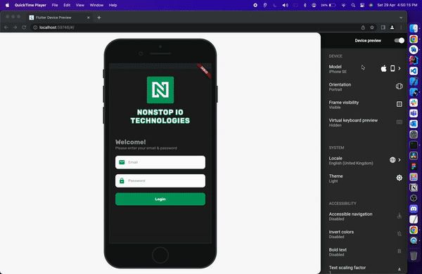

# flutter_device_preview

A example of how to use the device_preview package.

The device_preview package for Flutter provides a powerful and flexible way to preview an app's appearance and performance on multiple devices, allowing developers to test their apps quickly and efficiently. By using this tool, developers can ensure that their app looks and performs consistently on a wide range of devices, leading to a better user experience and higher customer satisfaction.

DEMO

